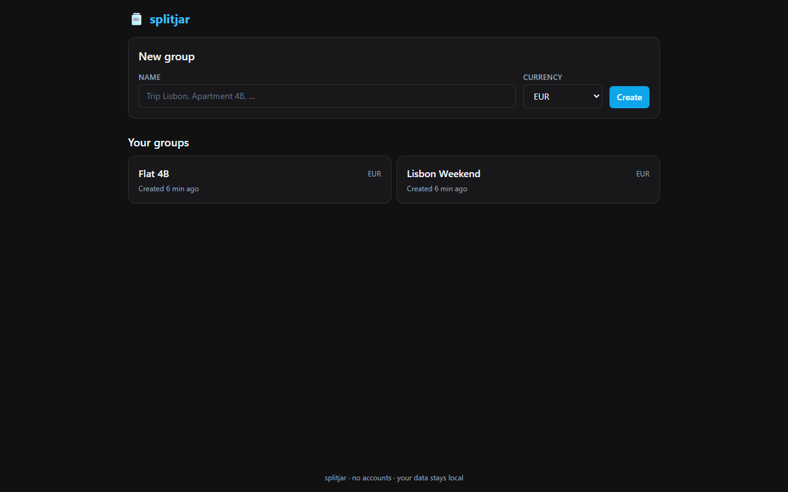
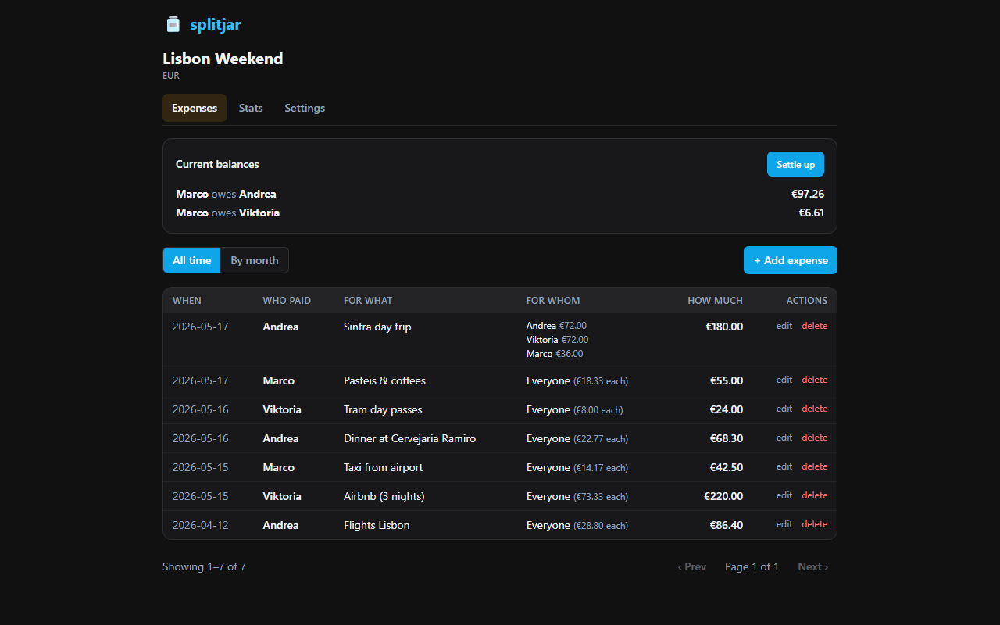
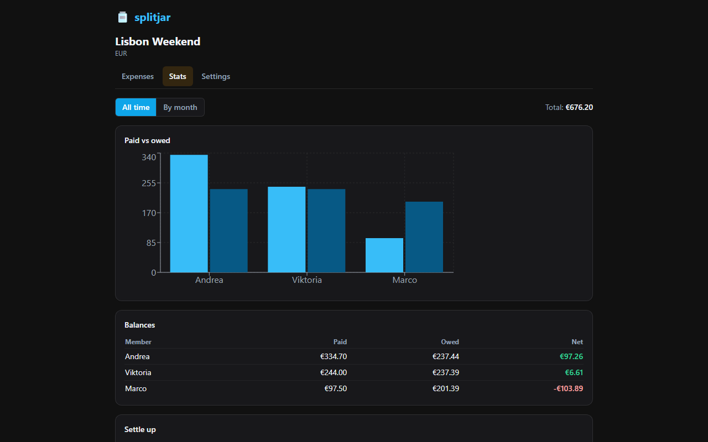
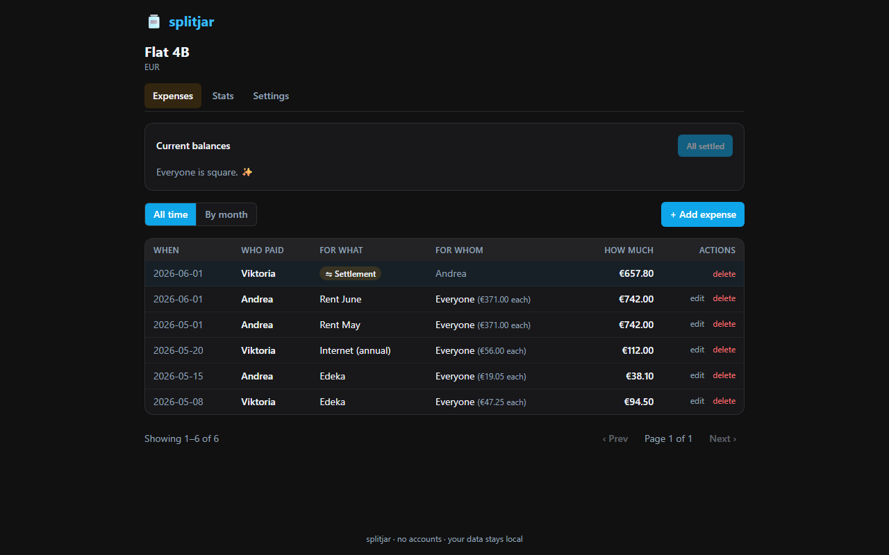
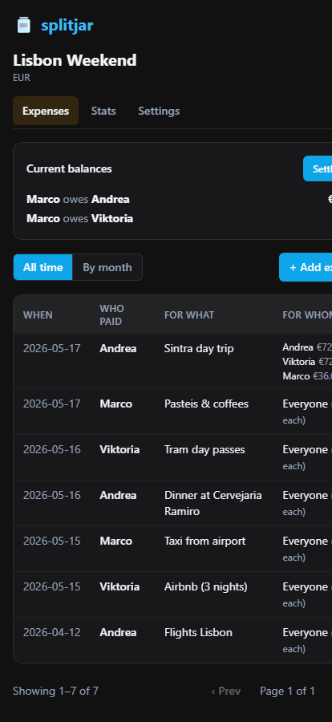
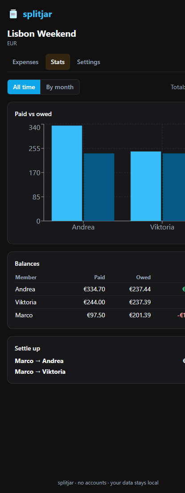

# splitjar 🫙

A tiny, no-auth expense-sharing app. Spin up a group (trip, household, anything), add the people in it, log expenses with who paid and what percentage each person owes, and see who owes whom at the end of the month.

Built to run as a single Docker container on your home server and embed inside a Home Assistant panel.

[](https://github.com/marinswk/splitjar/actions/workflows/test.yml)
[](LICENSE)
[](https://www.python.org/)

## Features

| | |
|---|---|
| 👥 **Groups** | Create as many as you like — a trip, an apartment, the office coffee fund. |
| 💱 **Per-group currency** | Each group has its own currency (no conversion, no multi-currency math). |
| 🧮 **Formulas in amounts** | Type `12.50 + 7*2` straight into the amount field and see the result live. |
| 📊 **Stats & settlement** | Per-member balances and a minimal "who pays whom" plan to settle up. |
| 🗓️ **Per-month views** | Filter expenses and stats by month. |
| 📱 **Phone & desktop** | Mobile-first responsive UI. |
| 🏠 **Home Assistant panel** | Embeds cleanly in an iframe panel. |
| 🔓 **No accounts, no auth** | Local-only by design — your data stays on your server. |

## Screenshots

<table>
  <tr>
    <td width="50%"></td>
    <td width="50%"></td>
  </tr>
  <tr>
    <td></td>
    <td></td>
  </tr>
  <tr>
    <td></td>
    <td></td>
  </tr>
</table>

## Quick start

```bash
git clone https://github.com/marinswk/splitjar.git
cd splitjar
docker compose up -d
```

Open <http://localhost:8473>.

Data is persisted in the `splitjar_data` Docker volume at `/data/splitjar.db`.

### Pull the prebuilt image instead

```bash
docker run -d --name splitjar \
  -p 8473:8473 \
  -v splitjar_data:/data \
  ghcr.io/marinswk/splitjar:latest
```

## Home Assistant embedding

Add to your `configuration.yaml`:

```yaml
panel_iframe:
  splitjar:
    title: "Splitjar"
    icon: mdi:cash-multiple
    url: "http://homeassistant.local:8473"
    require_admin: false
```

splitjar sets **no `X-Frame-Options` and no default `frame-ancestors`**, so the iframe works out of the box no matter where your HA is hosted. If you want to restrict who can embed splitjar, set the optional CSP via `.env`:

```dotenv
# Optional — only set if you want to lock embedding down
SPLITJAR_FRAME_ANCESTORS='self' https://your-home-assistant.example.com
```

See [docs/homeassistant.md](docs/homeassistant.md) for more.

## Tech stack

- **Backend** — FastAPI · SQLModel · SQLite (WAL) · Python 3.12+
- **Frontend** — React 18 · Vite · TypeScript · Tailwind · TanStack Query · Recharts
- **Packaging** — single multi-stage Docker image, < 200 MB
- **CI/CD** — GitHub Actions, multi-arch images pushed to GHCR on tag

## Configuration

| env var | default | purpose |
|---|---|---|
| `SPLITJAR_DATA_DIR` | `/data` | Where the SQLite file lives |
| `SPLITJAR_DB_URL` | _(from data dir)_ | Override the full SQLAlchemy URL |
| `SPLITJAR_STATIC_DIR` | `/app/static` | Frontend bundle location |
| `SPLITJAR_FRAME_ANCESTORS` | _(unset → no restriction)_ | Optional CSP `frame-ancestors` value |

## Project layout

```
splitjar/
├── backend/                FastAPI app + tests
│   └── app/
│       ├── main.py         factory, static fallback, CSP middleware
│       ├── db.py           SQLite engine, WAL pragmas
│       ├── models.py       Group / Member / Expense / ExpenseShare
│       ├── routers/        groups · members · expenses · stats · formula
│       └── services/       formula evaluator · settlement algorithm
├── frontend/               React + Vite + Tailwind SPA
│   └── src/
│       ├── pages/          GroupsList · GroupHome (tabs) · forms
│       ├── components/     FormulaInput · ShareEditor · MonthPicker
│       └── api/client.ts   typed fetch wrapper
├── docs/
│   ├── homeassistant.md
│   └── screenshots/
├── .github/workflows/      test.yml · release.yml
├── Dockerfile              multi-stage: frontend → backend → runtime
└── docker-compose.yml
```

## Development

```bash
# Backend
cd backend
python -m venv .venv && source .venv/bin/activate
pip install -e ".[dev]"
SPLITJAR_DATA_DIR=./data uvicorn app.main:app --reload

# Frontend (separate terminal — proxies /api to :8473)
cd frontend
npm install
npm run dev
```

Then open <http://localhost:5173>.

### Tests

```bash
docker build --target test -t splitjar-test .
docker run --rm splitjar-test
```

## Docs

- [Home Assistant setup](docs/homeassistant.md)
- [Roadmap](ROADMAP.md)
- [Contributing](CONTRIBUTING.md)
- [Security](SECURITY.md)

## License

[MIT](LICENSE)
